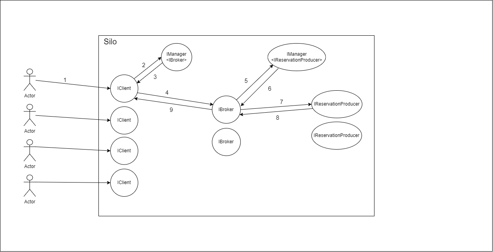
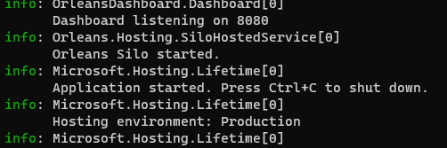
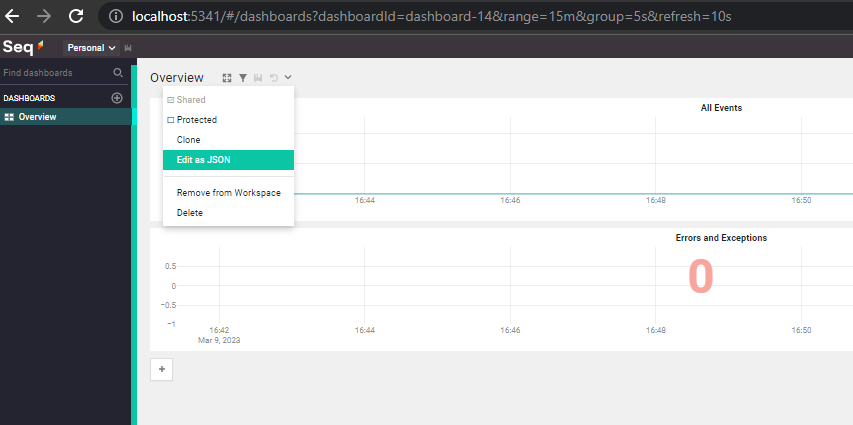
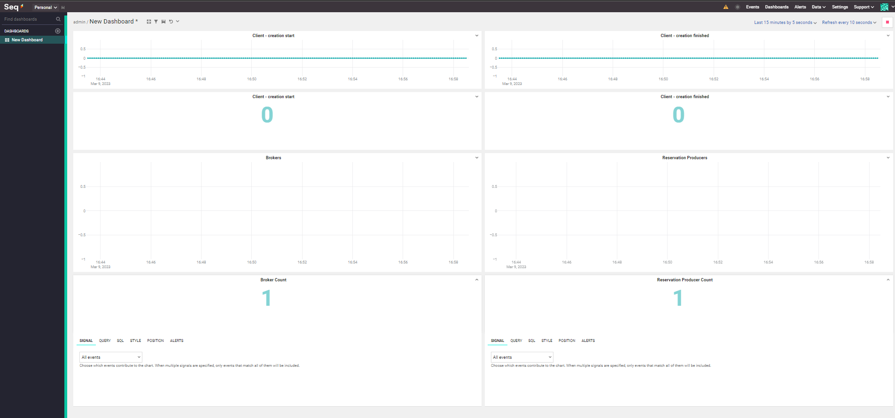
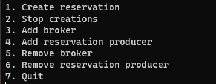
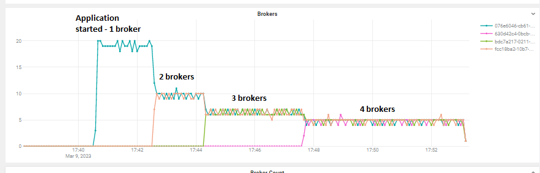
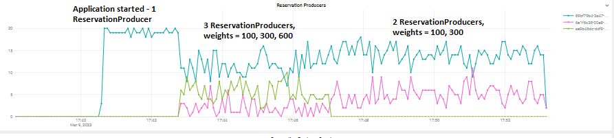

# 1. Overview

This application is a simulation of a simplified room reservation process. The main purpose of the simulation was to test the suitability and ease of use of the .NET Orleans framework. The application also presents two different load balancing techniques: round robin and weighted nodes approach.

# 2. Architecture

The architecture of the solution is depicted below:


The application consists of one silo and 5 different types of grains (silo and grain are Orleans primitives):
1) IClient,
2) IManager\<IBroker>,
3) IBroker,
4) IManager\<IReservationProducer>,
5) IReservationProducer

Key points to bear in mind:
1) Each reservation creation request activates a new IClient grain.
2) There is only one IManager\<IBroker>.
3) There is only one IManager\<IReservationProducer>.
4) IBroker grain can be added to the IManager\<IBroker>'s list of IBrokers. 
5) There is one IBroker at the start of the program. 
6) There is one IReservationProducer at the start of the program.
7) IReservationProducer grain can be added to the IManager\<IReservationProducer>'s list of IReservationProducers. 

Arrows present one fully finished execution path. Let's discuss arrows one by one:
1) Client starts a process of reservation creation. A single IClient grain gets activated.
2) The IClient asks an IManager\<IBroker> for an IBroker grain reference. The IManager\<IBroker> holds a list of IBroker grains.
3) The IManager\<IBroker> returns the IBroker reference to the IClient in a **round robin** manner.
4) The IClient passes the request to the IBroker.
5) The IBroker asks an IManager\<IReservationProducer> for an IReservationProducer grain reference. The IManager\<IReservationProducer> holds a list of IReservationProducer grains.
6) The IManager\<IReservationProducer> returns the IReservationProducer to the IBroker in a **weighted nodes** manner.
7) The IBroker passes the request to the IReservationProducer.
8) The IReservationProducer returns an identifier of allocated room to the IBroker.
9) The IBroker returns the identifier of the allocated room to the IClient

# 3. Run the application

The simulation uses the external log processing server (Seq) that has to be set up before the run.

## 3.1 Seq
To set up the Seq Server open terminal and run: 
```
docker run --name seq -d --restart unless-stopped -e ACCEPT_EULA=Y -p 5341:80 datalust/seq:latest
```

## 3.2 Simulation
To run the application a client and a server project have to be started.

Open first terminal in the solution directory and run:
```
dotnet run --project Reservations.Server
```
Wait until the server starts:



Open second terminal in the solution directory and run:
```
dotnet run --project Reservations.Client
```

Open a browser and go to the http://localhost:5341/#/events and go to the dashboard section. Edit existing dashboard by clicking "Edit as JSON" and paste the "seq.txt" file content (I couldn't find a way to automate it so the copy-paste required, sorry):



You should see something like this:




## 3.3 Simulation options

The second terminal (client) should have options to choose from:

 


The options are:
1) Starts the process of reservations creation. Requests run every 200-300 miliseconds. It can be run multiple times (one time is enough though).
2) Stops all the processes of reservations creation.
3) Adds a Broker to the IManager\<IBroker>'s list of IBroker grains.
4) Adds one or many ReservationProducers to the IManager\<IReservationProducer>'s list of IReservationProducer grains.
5) Removes lastly added Broker.
6) Removes lastly added ReservationProducer.
7) Quits the application.

## 3.4 Load balancing strategies

As mentioned before one of the main goal was to simulate two load balancing strategies: round robin and weighted nodes. IManager\<IBroker> is configured to return IBrokers to the IClients in a round robin approach. On the other hand, the IManager\<IReservationProducer> is configured to return IReservationProducers to the IBrokers by taking into account weight assigned to each IReservationProducer. Initially the existing IReservationProducer (the one that is created during the application startup) has weight = 100. If we add another IReservationProducer (option 4 from the menu) with the weight e.g. 200 it means that by having these two IReservationProducers (with weights 100 and 200 accordingly) ~100 out of 300 requests will be routed to the IReservationProducer with the weight = 100 whereas ~200 out of 300 will be routed to the IReservationProducer with the weight = 200.

## 3.4.1 Round robin 
I ran the program and chose 1. from the options menu - requests started. After some time I added one Broker then another one and eventually the fourth one. You can see on the "Brokers" chart that the requests were routed according to the Brokers count:

 

The more Brokers the less requests each Broker handles.

## 3.4.2 Weighted nodes

Alongside the Brokers I also added ReservationProducers. As mentioned before the first ReservationProducer was created during the application startup with wieight = 100. First, I added two ReservationProducers with weights 300 and 600, then I removed the one with the weight = 600. Similarly to the "Brokers" chart the chart "Reservation Producers" presents the number of requests each ReservationProducer handled over time.

 

We can see that the number of requests handled clearly depends on the ReservationProducer weight.

